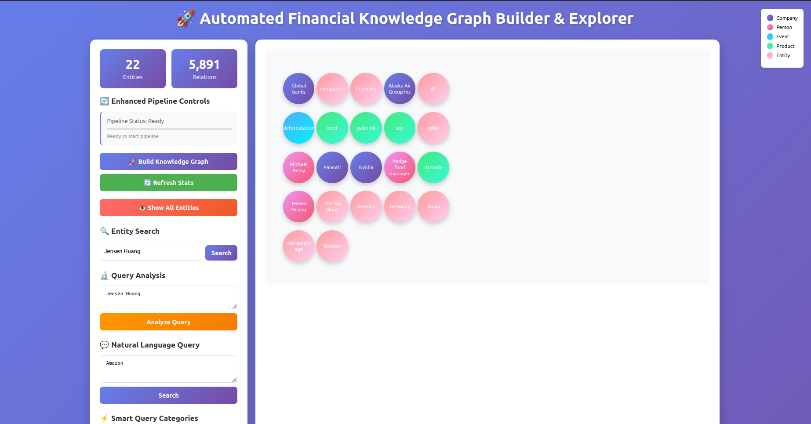
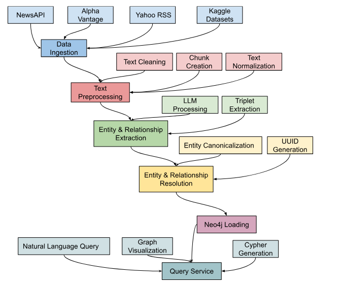

# Financial Knowledge Graph Builder & Explorer

## 📊 Overview

A comprehensive financial knowledge graph system that extracts, processes, and visualizes financial entities and relationships from news articles using natural language processing and Neo4j graph database technology.



## 🌟 Features

### Multi-Stage Data Pipeline (A-F)

- **A:** Data Ingestion - Collect financial news from multiple sources
- **B:** Text Preprocessing - Clean and chunk text data
- **C:** Entity Extraction - Identify companies, people, products, and events
- **D:** Entity Resolution - Canonicalize and resolve entity references
- **E:** Neo4j Loading - Store entities and relationships in graph database
- **F:** Natural Language Query - Interactive query interface with AI-powered translation

### Enhanced Query Service

The system now includes an improved natural language query service with:
- **AI-Powered Translation:** Converts natural language queries to Cypher using OpenAI GPT
- **Schema-Aware Generation:** Understands graph structure and relationships
- **Robust Error Handling:** Multiple fallback strategies for query parsing
- **Interactive Sessions:** Command-line interface for direct querying
- **Smart Result Formatting:** Proper handling of Neo4j nodes and relationships

### Web Interface

- **Real-time Pipeline Monitoring:** Live progress tracking and status updates
- **Interactive Graph Visualization:** Dynamic node-link diagrams with entity categorization
- **Entity Search:** Advanced search across all entities in the knowledge graph
- **Query Analysis:** Pre-execution analysis of natural language queries
- **Schema Exploration:** Detailed schema information and relationship patterns

## 🚀 Quick Start

### Prerequisites

- Python 3.8+
- Neo4j Database
- OpenAI API Key
- NewsAPI, Alpha Vantage, and FMP API keys

### Installation

1. **Clone the repository**

```bash
git clone <repository-url>
cd financial-knowledge-graph
```

2. **Install dependencies**

```bash
pip install -r requirements.txt
```

3. **Configure environment veriables**

Create a `.env` file:

```env
OPENAI_API_KEY=your_openai_api_key
NEWSAPI_KEY=your_newsapi_key
ALPHA_VANTAGE_KEY=your_alpha_vantage_key
FMP_KEY=your_fmp_key
NEO4J_URI=bolt://localhost:7687
NEO4J_USER=neo4j
NEO4J_PASSWORD=your_neo4j_password
BASE_DATA_DIR=./financial_news_data
```

4. **Start the application**

```bash
python app.py
```

5. **Access the web interface**

Open http://localhost:8080 in your browser

## 🐳 Neo4j Setup with Docker

### Prerequisites

#### Docker Installation

**Option 1: Docker Desktop (Recommended for Windows/Mac)**

1. **Download Docker Desktop:**

  - Windows: https://docs.docker.com/desktop/setup/install/windows-install/
  - Mac: https://docs.docker.com/desktop/setup/install/mac-install/
  - Linux: Use your package manager or see Docker Engine instructions below

2. **Install and Launch:**

  - Run the installer and follow setup instructions
  - Start Docker Desktop from your applications
  - Wait for Docker to be ready (whale icon in system tray)

3. **Verify Installation**:

```bash
docker --version
docker-compose --version
```

**Option 2: Docker Engine (Linux/Advanced Users)**

1. **Install Docker Engine:**

```bash
# Ubuntu/Debian
curl -fsSL https://get.docker.com -o get-docker.sh
sudo sh get-docker.sh
sudo usermod -aG docker $USER

# Restart shell or log out/in for group changes
```

2. **Install Docker Compose:**

```bash
# Linux
sudo curl -L "https://github.com/docker/compose/releases/download/v2.23.0/docker-compose-$(uname -s)-$(uname -m)" -o /usr/local/bin/docker-compose
sudo chmod +x /usr/local/bin/docker-compose
```

### 🚀 Quick Start with Docker Compose

1. **Save Docker Compose File**

Create a file named `docker-compose.yml` in your project root with this content:

```yaml
version: '3.8'

services:
  neo4j:
    image: neo4j:5.15.0
    container_name: financial-neo4j
    restart: unless-stopped
    ports:
      - "7474:7474"  # HTTP
      - "7687:7687"  # Bolt
    environment:
      # Credentials
      NEO4J_AUTH: neo4j/financial2025

      # Plugins
      NEO4JLABS_PLUGINS: '["apoc"]'

      # Allow APOC unrestricted procedures
      NEO4J_dbms_security_procedures_unrestricted: apoc.*
      NEO4J_dbms_security_procedures_allowlist: apoc.*
      
      # Memory settings
      NEO4J_dbms_memory_pagecache_size: 512M
      NEO4J_dbms_memory_heap_initial__size: 512M
      NEO4J_dbms_memory_heap_max__size: 1G
    volumes:
      - neo4j_data:/data
      - neo4j_logs:/logs
      - neo4j_import:/var/lib/neo4j/import
      - neo4j_plugins:/plugins

volumes:
  neo4j_data:
  neo4j_logs:
  neo4j_import:
  neo4j_plugins:
```

2. **Start Neo4j Container**

```bash
# Start the container
docker-compose up -d

# Check container status
docker-compose ps

# View logs
docker-compose logs neo4j
```

3. **Access Neo4j**

**Neo4j Browser:** http://localhost:7474
**Username:** neo4j
**Password:** financial2025

4. **Start Neo4j Container**

If the container has already been created previously, to run it again to have access to Neo4j, run the following command when Docker is active:

```bash
docker starrt financial-neo4j
```

5. **Management Commands**

**Common commands:**

```bash
# Start services
docker-compose up -d

# Stop services
docker-compose down

# Stop and remove volumes (WARNING: deletes data)
docker-compose down -v

# View logs
docker-compose logs -f neo4j

# Check status
docker-compose ps

# Execute commands in container
docker-compose exec neo4j cypher-shell -u neo4j -p financial2025
```

**Troubleshooting:**

```bash
# If container won't start
docker-compose down
docker-compose up --force-recreate

# Check resource usage
docker stats

# Reset if stuck
docker system prune -a
docker volume prune
```

## 📊 Pipeline Architecture

### 📊 Stage A: Data Ingestion

- Collects financial news from NewsAPI, Alpha Vantage, and Financial Modeling Prep
- Stores raw articles in compressed JSONL format
- Handles API rate limiting and error recovery

### 🧹 Stage B: Text Preprocessing

**Objective:** Convert unstructured text into clean, processable chunks suitable for entity extraction.

- Cleans and normalizes text content
- Splits articles into manageable chunks
- Removes duplicates and low-quality content

### 🔍 Stage C: Entity Extraction

**Objective:** Extract structured entities and relationships from text chunks using LLM capabilities.

- Uses OpenAI GPT to identify entities in text
- Extracts companies, people, products, events, and general entities
- Maintains context and relationships from source text

### 🛠️ Stage D: Entity Resolution

**Objective:** Standardize extracted data, resolve entity references, and prepare for graph database loading.

- Resolves entity mentions to canonical forms
- Links entities across different articles and sources
- Builds comprehensive entity-relationship structures

### 🗃️ Stage E: Neo4j Loading

**Objective:** Import cleaned triplets into Neo4j and build the knowledge graph.

- Creates nodes and relationships in Neo4j graph database
- Applies constraints and indexes for performance
- Maintains data provenance and source tracking

### 💬 Stage F: Natural Language Query Service

**Objective:** Enable intuitive querying of the knowledge graph using natural language.

```python
# Example usage of the enhanced query service
query_service = NaturalLanguageQueryService(
    neo4j_uri="bolt://localhost:7687",
    neo4j_user="neo4j", 
    neo4j_password="password",
    openai_api_key="your_openai_key"
)

# Execute natural language query
result = query_service.query("Find all companies related to Apple")
```

## 🔍 Query Examples

### Natural Language Queries

- "Find all companies mentioned in articles"
- "Show me entities related to Apple"
- "Find all articles from MarketWatch published after November 2025"

### Cypher Queries

```cypher
// Find entities by name
MATCH (n) WHERE toLower(n.name) CONTAINS 'apple' RETURN n

// Explore relationships
MATCH (a)-[r]->(b) WHERE a.name = 'Microsoft' RETURN a, r, b

// Filter by source and date
MATCH (n) WHERE n.source = 'MarketWatch' AND n.published_at >= '2025-11-01' RETURN n
```

## 🔄 End-to-End Pipeline Integration

**Objective:** Coordinate all stages into a seamless, automated workflow.

**Method:**

- Implement pipeline orchestration with stage dependencies
- Provide progress tracking and status monitoring across all stages
- Handle error recovery and partial pipeline execution
- Enable configuration management for different data sources and parameters
- Support incremental updates and reprocessing capabilities
- Maintain data lineage and processing history

Each stage builds upon the previous one, transforming raw financial news into a queryable knowledge graph that reveals complex relationships between financial entities, enabling advanced analytics and insights discovery.



## 🌐 Web Interface and Visualization

**Objective:** Provide user-friendly access to the knowledge graph with interactive visualization.

**Method:**

- Build Flask web application with real-time pipeline monitoring
- Implement dynamic graph visualization using D3.js or similar libraries
- Create entity search and exploration features
- Display pipeline progress, statistics, and error reporting
- Enable natural language query input with result visualization
- Provide schema exploration and debugging tools

## 🗄️ Data Schema

### Node Labels

- **Person:** Executives, employees, individuals
- **Company:** Corporations, businesses, organizations
- **Product:** Products, services, offerings
- **Event:** Corporate events, announcements, milestones
- **Entity:** General entities not fitting other categories

### Relationship Types

- `HAS`, `RELATED_TO`, `ANNOUNCED`, `ACQUIRED`
- `INVESTED_IN`, `PARTNERED_WITH`, `APPOINTED`
- `RESIGNED`, `LAUNCHED`, `INCREASED`, `DECREASED`

### Properties

- **id:** Unique identifier (UUID)
- **name:** Entity name
- **label:** Entity type
- **source:** Data source (MarketWatch, Bloomberg, etc.)
- **article_id:** Source article identifier
- **published_at:** Publication timestamp
- **confidence:** Extraction confidence score

## 🛠️ API Endpoints

### Pipeline Control

- `POST /api/pipeline/start` - Start knowledge graph construction
- `GET /api/pipeline/status` - Get pipeline status

### Graph Operations

- `GET /api/graph/stats` - Get graph statistics
- `GET /api/graph/has_data` - Check if graph contains data
- `GET /api/graph/sample` - Get sample graph data

### Query Interface

- `POST /api/query` - Execute natural language query
- `POST /api/query/analyze` - Analyze query without execution
- `POST /api/search/entities` - Search entities by name

### System Information

- `GET /api/schema` - Get schema information
- `GET /api/examples` - Get example queries

## 🔧 Configuration

### Environment Variables

- `OPENAI_API_KEY`: Required for entity extraction and query translation
- `NEWSAPI_KEY`, `ALPHA_VANTAGE_KEY`, `FMP_KEY`: Data source APIs
- `NEO4J_URI`, `NEO4J_USER`, `NEO4J_PASSWORD`: Database connection
- `BASE_DATA_DIR`: Local storage for processed data

### Pipeline Parameters

- **sample_size:** Number of chunks to process (default: 50)
- **run_ingestion:** Whether to fetch new data or use existing

## 📈 Monitoring & Debugging

### Pipeline Status

The web interface provides real-time monitoring of:

- Current pipeline stage and progress
- Statistics (articles collected, entities extracted, etc.)
- Error messages and debugging information

### Query Analysis

- Pre-execution query analysis with generated Cypher preview
- Schema validation and optimization suggestions
- Entity detection and relationship mapping

## 🚨 Troubleshooting

### Common Issues

1. **Neo4j Connection Failed**

  - Verify Neo4j is running and accessible
  - Check connection credentials in .env file

2. **OpenAI API Errors**

  - Validate API key is correct and has sufficient credits
  - Check rate limits and billing status

3. **Pipeline Stalls**

  - Monitor progress in web interface
  - Check individual stage logs for errors
  - Verify API keys for data sources

4. **Query Translation Failures**

  - Ensure natural language queries are clear and specific
  - Check that referenced entities exist in the graph
  - Review generated Cypher for syntax errors

## 📁 Project Structure

```text
financial-knowledge-graph/
├── app.py                 # Flask web application
├── requirements.txt       # Python dependencies
├── .env                  # Environment variables
├── templates/
│   └── index.html        # Web interface
├── knowledge_graph_pipeline.py
├── load_env.py
├── docker-compose.yml
├── README.md
└── src/
    ├── a_data_ingestion/
        └── data_ingestion.py
    ├── b_text_preprocessing/
        └── text_preprocessing.py
    ├── c_entity_extraction/
        └── entity_extraction.py
    ├── d_entity_resolution/
        └── entity_resolution.py
    ├── e_neo4j_loading/
        └── neo4j_loading.py
    └── f_query_service/
        └── natural_language_query_service.py
```

## 📄 License

This project is licensed under the MIT License.